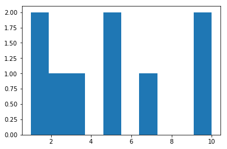

Here's the link to the [first post](https://caffreit.github.io/ParkRunPart1/) of the Malahide ParkRun analysis.


## Welcome to GitHub Pages

You can use the [editor on GitHub](https://github.com/caffreit/blog-/edit/gh-pages/README.md) to maintain and preview the content for your website in Markdown files.

Whenever you commit to this repository, GitHub Pages will run [Jekyll](https://jekyllrb.com/) to rebuild the pages in your site, from the content in your Markdown files.

### Markdown

Markdown is a lightweight and easy-to-use syntax for styling your writing. It includes conventions for

```markdown
Syntax highlighted code block

# Header 1
## Header 2
### Header 3

- Bulleted
- List

1. Numbered
2. List

**Bold** and _Italic_ and `Code` text

[Link](url) and 
```

For more details see [GitHub Flavored Markdown](https://guides.github.com/features/mastering-markdown/).

### Jekyll Themes

Your Pages site will use the layout and styles from the Jekyll theme you have selected in your [repository settings](https://github.com/caffreit/blog-/settings). The name of this theme is saved in the Jekyll `_config.yml` configuration file.

### Support or Contact

Having trouble with Pages? Check out our [documentation](https://help.github.com/categories/github-pages-basics/) or [contact support](https://github.com/contact) and we’ll help you sort it out.

[testlink](https://caffreit.github.io/testpark/)


```python
import random

random.randint(0,100)
```


    79


```python

import matplotlib.pyplot as plt

%matplotlib inline

plt.hist([10,5,7,10,1,1,2,3,5])
```


    (array([ 2.,  1.,  1.,  0.,  2.,  0.,  1.,  0.,  0.,  2.]),
     array([  1. ,   1.9,   2.5,   3.7,   4.6,   5.5,   6.4,   7.3,   8.2,
              9.1,  10. ]),
     <a list of 10 Patch objects>)




