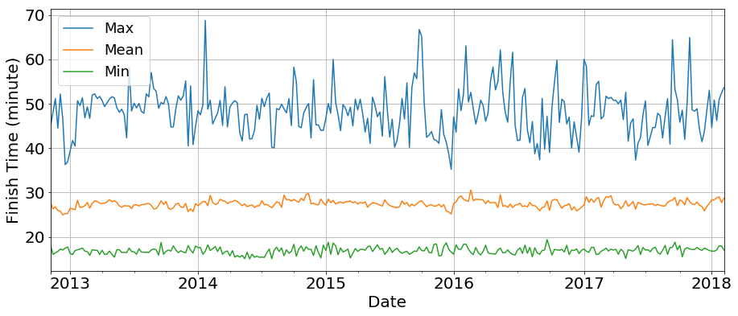

## Welcome to my blog-
This blog has two purposes, the first is to help secure a job by showcasing my portfolio of coding experience. [See more](https://github.com/caffreit) of my academic work.

The second is to serve as a reference for me when I'm working on future projects.

My first project to be published will be a series on the Malahide Park Run. This is a set of roughly 80 thousand runs, each run has a finish time, name, age and several other attributes recorded. This rich dataset is ideal to improve my data science skills.

Oh, and for the moment (next week or so), this blog is under construction and will look a bit rough around the edges! (>.<)

## [Exploratory Analysis](https://caffreit.github.io/ParkRun_Part_1/) of the Malahide ParkRun data.

## [Whether the weather](https://caffreit.github.io/Weather_Effects/) affects the Malahide ParkRun.

## [Battle](https://caffreit.github.io/Battle-of-the-Sexes-ParkRun/) of the Sexes in Malahide ParkRun.

